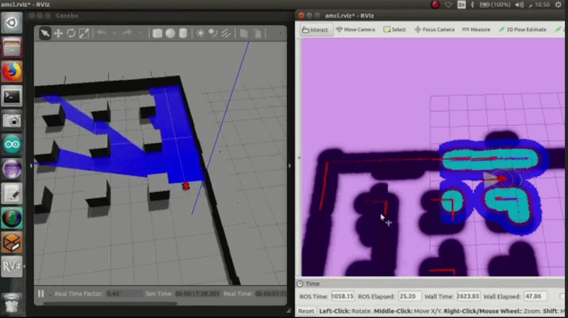

# Ladybug-Bot — Autonomous Mobile Robot

A 4-wheel differential drive mobile robot built for autonomous indoor
navigation: LiDAR-based SLAM, AMCL localization, and `move_base` path
planning (Dijkstra global planner + DWA local planner), running on
ROS1 and Gazebo.



## Demo

- **Real robot build:** [Watch on YouTube](https://www.youtube.com/watch?v=ZH3-5whKDpE)
- **Simulation walkthrough:** GIF above — SLAM mapping and autonomous
  navigation around obstacles, running in Gazebo

## Overview

Ladybug-Bot uses a 4-wheel differential drive chassis with:

- **LiDAR** — 360° environment scanning for mapping and obstacle detection
- **GPS** — global positioning
- **Wheel encoders + IMU** — odometry, fused via an Extended Kalman Filter
- **DC motors** — drive actuation

### Navigation stack
- **Mapping:** Gmapping (particle-filter SLAM)
- **Localization:** AMCL + map_server
- **Path planning:** `move_base` with Dijkstra global planner and DWA
  local planner, using layered local/global costmaps

## Repo structure

| Package                     | Purpose                                          |
|------------------------------|---------------------------------------------------|
| `ladybug_bot_description`   | URDF/xacro robot model, RViz check                 |
| `ladybug_bot_gazebo`        | Gazebo world + spawning the robot                  |
| `ladybug_bot_navigation`    | gmapping, AMCL, move_base (Dijkstra + DWA)          |
| `ladybug_bot_teleop`        | Keyboard driving for manual mapping runs            |
| `media/`                    | Demo GIF                                           |

## Requirements

ROS1 Noetic on Ubuntu 20.04 (or via Docker, see below, on any host OS).

```bash
sudo apt install ros-noetic-gazebo-ros-pkgs ros-noetic-gmapping \
  ros-noetic-amcl ros-noetic-move-base ros-noetic-map-server \
  ros-noetic-global-planner ros-noetic-dwa-local-planner \
  ros-noetic-joint-state-publisher-gui ros-noetic-teleop-twist-keyboard \
  ros-noetic-hector-gazebo-plugins
```

## Build

```bash
cd ladybug_bot_ws
catkin_make
source devel/setup.bash
```

## Run order

**1. Check the URDF in RViz:**
```bash
roslaunch ladybug_bot_description display.launch
```

**2. Spawn the robot in the Gazebo world:**
```bash
roslaunch ladybug_bot_gazebo ladybug_bot_world.launch
```

**3. Build a map by driving the robot around** (second terminal):
```bash
roslaunch ladybug_bot_navigation gmapping_demo.launch
roslaunch ladybug_bot_teleop keyboard_teleop.launch
```
Once the map looks complete in RViz, save it:
```bash
rosrun map_server map_saver -f src/ladybug_bot_navigation/maps/hotel_room
```

**4. Run full autonomous navigation:**
```bash
roslaunch ladybug_bot_navigation navigation_demo.launch
```
Set a "2D Nav Goal" in RViz and watch it plan a path and drive there,
navigating around obstacles.

## Team

Built by Rana Abdulrahman Al-Ariqi, Marwa Omar Al-Sakaf, and Nouran
Nadhem Haider — Mechatronics Engineering, Sana'a University.
Supervised by Eng. Mahran Mansour Al-Absi.


